<h3><code>abhinav@github ~ $ ./contributions.sh</code></h3>

  

<h3><code>abhinav@github ~ $ whoami</code></h3>

 

<h3><code>abhinav@github ~ $ ls projects/</code></h3>

**🩺 MedKart** — Pharmacy Management System · React · Node.js · Express · MongoDB
[GitHub](https://github.com/abhi9rai) • [Live Demo](#)

**📚 PrepSense** — RAG Study Assistant · Node.js · Express · RAG · LLM
[GitHub](https://github.com/abhi9rai) • [Live Demo](#)

 

`while(alive) { keepBuilding(); }`

